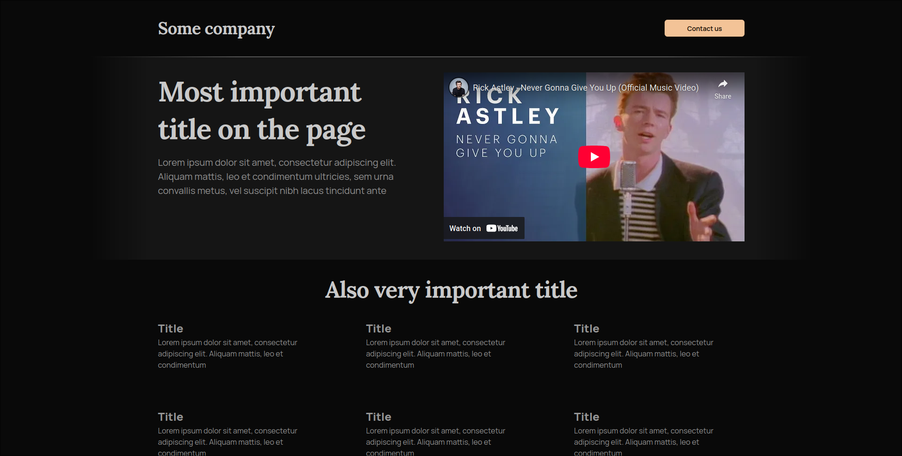
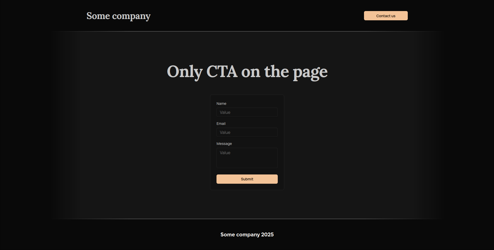
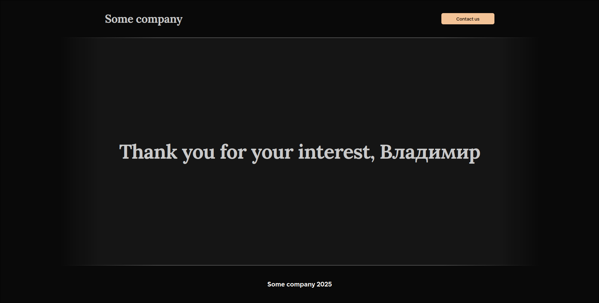

# CAD Exchanger - Тестовое задание

В этом репозитории содержится реализация тестового задания для вакансии Frontend-разработчика в компании CAD Exchanger

### Задание

Техническое задание можно прочитать [здесь](https://download.cadexchanger.com/documents/hiring/frontend/CADEX+frontend+developer+assigment+for+probationeers.pdf).

### Реализация

Задание реализовано на React с использованием TypeScript и следующих библиотек:

- [MUI Joy](https://mui.com/joy-ui/getting-started/) - библиотека UI компонентов
- [React Router](https://reactrouter.com/) - маршрутизация в приложении
- [Axios](https://axios-http.com/) - отправка запросов
- [Emotion Styled (с надстройками из MUI Joy)](https://emotion.sh/docs/styled) - CSS-in-JS

Запущенный экземпляр реализации можно посмотреть [здесь](https://ce.kbtw.ru).

#### Стилизация

Цвета, использованные в приложении, взяты из библиотеки [kbtw.ui](https://github.com/katsukibtw/kbtw.ui).

Использованные шрифты:

- [Lora](https://fonts.google.com/specimen/Lora) - serif шрифт, использованный для заголовков
- [Manrope](https://fonts.google.com/specimen/Manrope) - sans-serif, использованный для всего остального теста.
- [Inter](https://fonts.google.com/specimen/Inter) - sans-serif, использованный как fallback

#### Self-hosting

Приложение обернуто в docker, поэтому для запуска своего экземпляра приложения на своем сервере
достаточно склонировать репозиторий, отредактировать `.env` и запустить compose.

```sh
git clone https://github.com/katsukibtw/cadex-test && cd cadex-test
cp .env.example .env # !! Не забудьте поменять значения в .env
docker compose up -d
```

Если планируется вывод приложения во внешнюю сеть, то придется отредактировать переменные в `.env`:

```sh
EXTERNAL_URL=http://localhost/api # заменить ссылку на действительную, с внешним доменом.
                                  # например https://example.com/api
PROXY_PORT=80 # поменять на любой незанятый порт, если планируется использовать reverse proxy
```

#### Скриншоты




